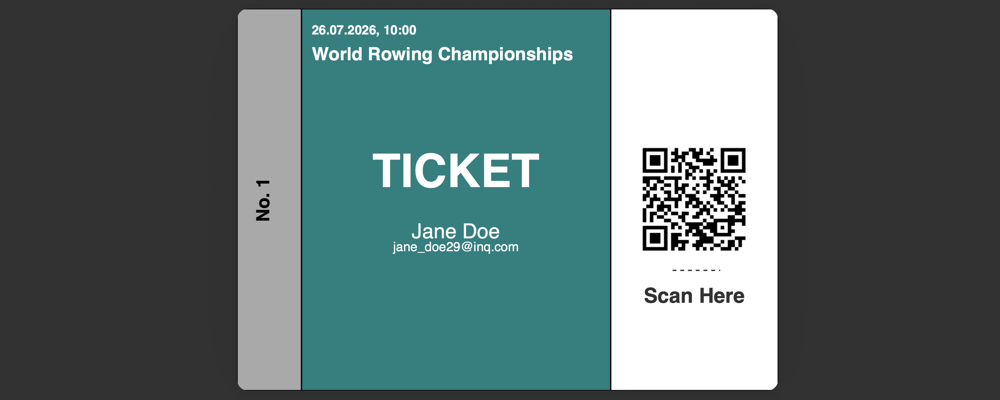

# 🎟️ InQ – Event Ticketing System  

This is a personal practice project by **Luca Britten**, built to improve backend development skills in **Java** and **Spring Boot**.  
The project simulates a simple **event ticketing system**, where events, users, and tickets can be managed. Tickets are generated with **QR codes** and can be validated to mark them as used.  

---

## ✨ Features
- **Event Management**
  - Create, update, delete, and list events  
  - Events include name, location, and date  

- **User Management**
  - Create and list users  
  - Associate tickets with users  

- **Ticketing System**
  - Generate tickets linked to events and users  
  - Tickets include a **QR code** and can be exported as a **PDF**  
  - Ticket statuses: `VALID`, `USED`, `INVALID`  
  - Validate tickets via REST endpoint (e.g., when scanning QR codes)  

- **Error Handling**
  - REST responses with appropriate HTTP status codes  
  - Validation errors for invalid or expired tickets  

---

## 🎫 Example Ticket

Here’s an example of a generated ticket with QR code:



[📄 Download Example Ticket (PDF)](docs/example-ticket.pdf)

---
## 🛠️ Tech Stack

### Backend
- **Framework:** Spring Boot (3.x)  
- **Database:** H2 (in-memory, for development)  
- **ORM:** Hibernate / JPA  
- **Build Tool:** Maven  
- **QR Code Generator:** ZXing  
- **PDF Export:** openPDF  
- **Testing:** JUnit 5, Spring Boot Test, Mockito  

### Frontend
- **Framework:** React 19 with TypeScript
- **Build Tool:** Vite
- **Styling:** TailwindCSS
- **Routing:** React Router
- **HTTP Client:** Axios
- **QR Code:** qrcode.react, @zxing/library
- **Testing:** Vitest, React Testing Library

---

## 📂 Project Structure
```
InQ/
├── src/main/java/com/software/inq/  # Backend (Spring Boot)
│   ├── controller     # REST controllers (Event, User, Ticket)
│   ├── dto            # Data Transfer Objects for APIs
│   ├── exception      # Custom exceptions & global handler
│   ├── mapper         # Mapper classes (Entity ↔ DTO)
│   ├── model          # JPA entities (Event, Ticket, User, TicketStatus enum)
│   ├── repository     # Spring Data JPA repositories
│   └── service        # Business logic (event, user, ticket services)
├── frontend/          # Frontend (React + TypeScript)
│   ├── src/
│   │   ├── components/   # Reusable UI components
│   │   ├── pages/        # Page components for each route
│   │   ├── services/     # API service layer
│   │   └── types/        # TypeScript type definitions
│   └── package.json
└── pom.xml
```

---

## 🚀 Getting Started

### Prerequisites
- Java 21+  
- Maven 3+  
- Node.js 20+ and npm (for frontend)
- IDE like IntelliJ IDEA or VS Code

### Run the Backend
```bash
./mvnw spring-boot:run
```

The backend will start at:  
👉 `http://localhost:8080`

### Run the Frontend
```bash
cd frontend
npm install
npm run dev
```

The frontend will start at:  
👉 `http://localhost:5173`

For more details on the frontend, see [frontend/README.md](frontend/README.md)

---

## 📌 API Endpoints

### Event Endpoints
- `GET /api/events` → list all events  
- `GET /api/events/{id}` → get single event  
- `POST /api/events` → create new event  
- `PUT /api/events/{id}` → update event  
- `DELETE /api/events/{id}` → delete event  

### User Endpoints
- `GET /api/users` → list all users  
- `GET /api/users/{id}` → get user details  
- `POST /api/users` → create new user  

### Ticket Endpoints
- `GET /api/tickets` → list all tickets  
- `GET /api/tickets/{id}` → get single ticket  
- `POST /api/tickets` → create new ticket (generates QR + PDF)  
- `POST /api/tickets/{id}/use` → validate (mark as `USED`)  

---

## 🧪 Testing

Integration tests exist for:
- EventController (CRUD operations)  
- TicketController (creation & validation)  

Run all tests with:
```bash
./mvnw test
```

---

## 🔮 Next Steps
- Add global exception handling (`@ControllerAdvice`)  
- Improve TicketDTO with event info (name, date)  
- Extend tests for negative cases (invalid tickets, duplicate users, etc.)  
- Optional: Connect a frontend to scan QR codes and validate tickets  

---

## 👤 Author
- **Luca Britten**  
  Practicing Java & Spring Boot development  
